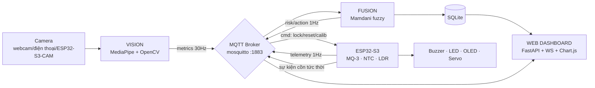

# Đặc tả thiết kế — Hệ thống IoT giám sát an toàn tài xế

> **Tên dự án:** DriverSafe-IoT — Giám sát buồn ngủ (AI Vision), nồng độ cồn (MQ-3) và môi trường cabin (NTC, LDR)
> **Ngày:** 2026-09-15 · **Phiên bản:** 1.0 · **Trạng thái:** Chờ review
> **Team:** 2 người — A (Embedded/firmware), B (Python/AI/backend) · **Thời gian:** 4 tuần
> **Phương án kiến trúc:** A — "Sensing-first Hybrid" (ESP32-S3 node cảm biến + host PC chạy AI Vision & Fusion)

---

## 1. Tổng quan & mục tiêu

Hệ thống giám sát trạng thái tài xế theo thời gian thực, kết hợp 3 nguồn dữ liệu độc lập:

1. **AI Vision** — camera quay mặt tài xế, tính các chỉ số nhãn khoa/cơ (EAR, PERCLOS, MAR, head pose) để phát hiện buồn ngủ **trước khi** tài xế ngủ trong vô thức.
2. **Cồn (MQ-3)** — cảnh báo sớm khi phát hiện hơi cồn trong cabin.
3. **Môi trường cabin (NTC + LDR)** — nhiệt độ và ánh sáng là *yếu tố nguy cơ nền* (nóng bức, thiếu sáng làm tăng buồn ngủ), đồng thời LDR dùng để **thích ứng ngưỡng Vision theo ngày/đêm**.

Điểm lõi của thiết kế: **không cảnh báo rời rạc từng cảm biến**, mà hợp nhất (fusion) đa nguồn bằng suy luận mờ Mamdani thành một **Risk Score 0–100**, từ đó ra quyết định cảnh báo phân tầng — kể cả phương án khóa động cơ khi cồn vượt ngưỡng.

**Mục tiêu học thuật** (khớp tiêu chí chấm: thuật toán + ứng dụng + độ khó):
- Thuật toán Vision đúng chuẩn nghiên cứu: PERCLOS cửa sổ trượt, ngưỡng **cá nhân hóa theo tài xế**.
- Xử lý trung thực các giới hạn vật lý của cảm biến (trôi MQ-3, phụ thuộc nhiệt độ) bằng hiệu chuẩn + bù nhiệt.
- Kiến trúc 2 lớp có lập luận: thiết bị tự bảo vệ khi mất kết nối (edge autonomy).

## 2. Phạm vi

**Làm (in-scope):**
- Node ESP32-S3: MQ-3, NTC, LDR, buzzer, LED RGB, OLED I2C, servo SG90 (mô phỏng khóa động cơ), FSM cảnh báo cục bộ, MQTT.
- Host (laptop demo): AI Vision (MediaPipe Face Mesh), engine Fusion (Mamdani), Mosquitto broker, Web dashboard (tự viết, FastAPI + WebSocket + SQLite).
- Hiệu chuẩn cá nhân tài xế (60s baseline) + hiệu chuẩn đường cong MQ-3 + bộ dữ liệu thực nghiệm cho báo cáo.
- Camera demo: webcam laptop/điện thoại (DroidCam). ESP32-S3-CAM stream MJPEG là **lối vào thay thế + bằng chứng embedded**.

**Không làm (YAGNI — cắt có ý thức, ghi trong báo cáo):**
- Không train CNN riêng / không nhồi mô hình vào ESP32.
- Không nhận diện đa tài xế (1 hồ sơ hiệu chuẩn/lượt demo).
- Không mobile app, không cloud bên thứ ba, không GPS/OTA/3D-print.
- **Không định vị MQ-3 là thiết bị định lượng pháp lý** — chỉ là cảnh báo sớm (xem §7.1.5).

## 3. Kiến trúc tổng thể



**Nguyên tắc chia tải:**
- **ESP32-S3** = tầng *cảm biến + phản xạ cục bộ*: đo, tiền xử lý, chạy FSM riêng (mất WiFi/vẫn kêu còi), chấp hành cảnh báo tại chỗ, nhận lệnh khóa/reset.
- **Host** = tầng *nhận thức*: Vision, fusion, lưu lịch sử, dashboard. Host **không phải điểm hỏng duy nhất**: mất host thì ESP32 vẫn cảnh báo cồn/nhiệt bằng ngưỡng cục bộ (degraded mode, xem §7.4).

**Luồng dữ liệu (1 vòng, < 1s):**
1. Camera → Vision tính EAR/MAR/PITCH từng frame, đẩy cửa sổ thời gian (PERCLOS 60s, blink duration, yawn/min) → publish `ds/vision/metrics`.
2. ESP32 đọc ADC (10Hz, lọc IIR) → quy đổi vật lý → publish `ds/esp32/sensors` (1Hz) + `ds/esp32/events` (tức thời khi vượt ngưỡng cục bộ).
3. Fusion nhận cả 2 luồng → tính RISK 0–100 → publish `ds/fusion/level`; đổi tầng action → publish `ds/esp32/cmd` + `ds/events` (log) + đẩy WebSocket xuống dashboard.
4. ESP32 nhận cmd → buzzer/LED/servo/OLED; FSM cục bộ của nó **luôn OR với** lệnh từ host (lệnh host không thể tắt còi khi đang cồn cao).

**Truyền thông:** WiFi/LAN nội bộ (AP nhà/hotspot demo) + MQTT QoS1. Mất kết nối > 5s: dashboard hiện "node offline", ESP32 tự chủ, host tự recovery khi nhận lại telemetry (không cần can thiệp).

## 4. Phần cứng & ngân sách (BOM)

| # | Linh kiện | SL | Đơn giá (ước tính) | Vai trò |
|---|---|---|---|---|
| 1 | ESP32-S3-DevKitC-1 (N16R8) | 1 | ~120k | Node cảm biến + chấp hành |
| 2 | Module MQ-3 (có sẵn RL + output AO/DO) | 1 | ~35k | Cảm biến hơi cồn |
| 3 | NTC 10K (B=3950) + điện trở 10K | 1 | ~10k | Nhiệt độ cabin |
| 4 | LDR 5mm + điện trở 10K | 1 | ~5k | Ánh sáng cabin |
| 5 | OLED SSD1306 0.96" I2C | 1 | ~55k | Hiển thị trạng thái tại chỗ |
| 6 | Buzzer active 5V/3.3V | 1 | ~5k | Cảnh báo âm |
| 7 | LED RGB (hoặc 3 LED đơn) | 1 | ~5k | Cảnh báo thị giác |
| 8 | Servo SG90 | 1 | ~25k | Mô phỏng khóa động cơ |
| 9 | Breadboard + dây + nguồn 5V (USB) | 1 | ~70k | Lắp ráp |
| 10 | (Tùy chọn, nếu còn budget) ESP32-S3-CAM + OV2640 | 0–1 | ~130k | Lối vào Vision embedded |
| **Tổng (không dòng 10)** | | | **~330k** ✅ < 500k | |

Ghi chú kỹ thuật:
- MQ-3 heater ăn 5V; tín hiệu analog của module có thể chạm gần 5V → **chia áp còn ≤3.3V** trước khi vào ADC ESP32 (vd 3.3k/2.2k → ratio 0.4). NTC/LDR dùng divider 10K kéo về 3.3V, không cần chia thêm.
- Chung mass giữa USB cấp nguồn và mọi module; nguồn 5V ≥ 500mA (heater MQ-3 hút dòng khi ổn định nhiệt).
- Đặt hàng **ngay ngày đầu tuần 1**; chọn nơi giao nội thành 1–2 ngày (rủi ro R5 §14).

## 5. Giao thức MQTT — topic & schema

Prefix `ds/` (driver-safe). JSON UTF-8, epoch `ts` tính bằng ms.

| Topic | Chiều | Tần suất | QoS/Retain | Nội dung |
|---|---|---|---|---|
| `ds/esp32/sensors` | ESP32→host | 1 Hz | QoS0 | `{"ts":..,"mq3_ao_v":2.41,"rs_r0":3.2,"alcohol_g_l":0.04,"temp_c":31.2,"ldr_pct":18,"lux_mode":"dark","rssi":-54,"uptime_s":..,"degraded":false}` |
| `ds/esp32/events` | ESP32→host | tức thời | QoS1 | `{"ts":..,"event":"alcohol_level2","raw":"mq3_ao_v=3.1"}` |
| `ds/vision/metrics` | host→host | 1 Hz (aggregated; frame-level chỉ giữ trong RAM) | QoS0 | `{"ts":..,"face":true,"ear":0.24,"perclos_60s":0.07,"cles_dur_ms":120,"mar":0.31,"yawn_per_min":1.2,"head_pitch_deg":3.1,"head_drop":false,"lux_mode":"day"}` |
| `ds/fusion/level` | fusion→mọi nơi | 1 Hz | QoS1 + **retain** | `{"ts":..,"risk":42,"band":"WARN","drivers":["perclos","alcohol"],"action":"beep_1"}` |
| `ds/esp32/cmd` | fusion→ESP32 | theo sự kiện | QoS1 | `{"cmd":"lock","sig":"1"}` / `{"cmd":"unlock","sig":"1"}` / `{"cmd":"beep","n":2}` / `{"cmd":"oled","msg":"..."}]` |
| `ds/events` | fusion→dashboard | theo sự kiện | QoS1 | bản ghi sự kiện đã log vào SQLite |

Quy ước thời gian: host lấy clock PC; ESP32 đính `uptime_s` để suy ra offset — mọi `ts` được host chuẩn hóa về clock PC trước khi vào DB.

## 6. Thuật toán Vision (host — người B)

### 6.1 Pipeline

```
frame (MJPEG/USB, ~30fps, 640×480) 
→ MediaPipe Face Mesh (468 landmarks, max 1 face)
→ chỉ số hình học /frame: EAR, MAR, pitch (solvePnP)
→ lớp thời gian (circular buffer 60s): PERCLOS, CLES duration, yawn/min, head-drop
→ publish metrics (1Hz) + publish ngay khi có event (microsleep, head_drop, yawn)
```

Chỉ dùng `mediapipe`, `opencv-python`, `numpy`. Ảnh vào grayscale không cần; Face Mesh tự xử lý ánh sáng yếu ở mức khá.

### 6.2 Các chỉ số

- **EAR (Eye Aspect Ratio)** — 6 điểm mắt mỗi bên (chỉ số landmark MediaPipe được ghi trong phụ lục mã nguồn):
  `EAR = (|p2−p6| + |p3−p5|) / (2·|p1−p4|)`. Chuẩn hóa theo khoảng cách 2 mắt để **độc lập khoảng cách camera/kích thước mặt**: `EAR_norm = EAR / (|p_left_eye_outer − p_right_eye_outer|)`.
- **Trạng thái mắt khép** — `EAR_norm < T_closed` (ngưỡng cá nhân, §6.3). Lớp thời gian chống nhiễu: cần ≥ 3 frame liên tiếp (≈100ms).
- **CLES duration** — độ dài một lần mắt khép liên tục. Blink bình thường: 100–250ms. **Eye-closure event: ≥ 250ms.** **Microsleep: ≥ 500ms** → event tức thời lên fusion.
- **PERCLOS(P78)** — tỷ lệ thời gian mắt khép trên **cửa sổ trượt 60s**, tính bằng cách đếm frame (mẫu chuẩn hóa xuống 10Hz để buffer gọn). PERCLOS là chỉ số NHTSA công nhận — dùng làm đầu vào chính của fusion.
- **MAR & ngáp** — `MAR = |p_lips_ver| / |p_lips_hor|` (chuẩn hóa tương tự). Ngáp = MAR ≥ `T_yawn` cá nhân **duy trì ≥ 400ms** (mở→khép 1 chu kỳ). Đếm yawn/phút.
- **Head pose (gật đầu)** — `cv2.solvePnP` với 5 điểm mặt 3D mô hình hóa (2 mắt, mũi, 2 mép miệng) → Euler pitch. Ghi **pitch trung tính 5s** ngay sau khi enroll. `head_drop = pitch > neutral + 15°` kéo dài ≥ 0.8s. Nghiêng mặt tự nhiên khi ngồi thoải mái không rơi vào ±15° → ít dương giả.
- **Mất track** — không thấy mặt ≥ 2s → event `face_lost` (tài xế cúi/ngửa quá mức hoặc camera bị che — cũng đáng cảnh báo).

### 6.3 Cá nhân hóa ngưỡng (điểm thuật toán thứ nhất)

Không dùng hằng số sách vở (EAR < 0.25 đại trà) vì EAR phụ thuộc giải phẫu từng người. Khi demo, chạy **enroll 60s**: tài xế nhìn thẳng, tỉnh táo → thu EAR_norm phân bố ≈ N(μ, σ):
- `T_closed = μ − 1.5σ`; `T_yawn = μ_mar_open + 1.5·σ_mar` (khi enroll yêu cầu há miệng 1 lần để bắt μ_mar).
- Báo cáo chứng minh bằng thực nghiệm §15: so sánh PERCLOS cố định vs cá nhân hóa trên cùng dữ liệu.

### 6.4 Thích ứng ngày/đêm

LDR node gửi `lux_mode` (đủ sáng/thiếu sáng/tối, §7.3). Khi `tối`: Vision giảm độ tin cậy (báo trong metrics), chuyển ngưỡng T_closed sang hệ số k=2.0σ (chặt hơn), và fusion coi "tối + buồn ngủ" là tổ hợp nguy cơ (rule R-cabin). Đây là chỗ 2 subsystem Vision↔cảm biến **thật sự nói chuyện với nhau** — nói sâu trong báo cáo.

## 7. Thuật toán cảm biến (ESP32-S3 — người A)

### 7.1 MQ-3 — cồn

**7.1.1 Thu tín hiệu:** AO qua chia áp về ≤3.3V → ADC1, attenuation 11dB. ADC ESP32 phi tuyến → **hiệu chuẩn mỗi bo** bằng multimeter ở 5 điểm (0.5/1.2/2.0/2.7/3.2V) → fit đa thức bậc 2 lưu trong firmware. Lấy mẫu 10Hz, lọc IIR bậc 1 `y = 0.8·y_prev + 0.2·x` (hằng số thực nghiệm tuần 1), median 5 điểm khi phát hiện sự kiện.

**7.1.2 Quy đổi điện trở cảm biến:** `Rs = (V_H / V_out − 1) · R_L` (V_H = 5V, R_L đọc từ module, đo kiểm bằng đồng hồ). Warm-up bắt buộc: sau bật nguồn **≥ 10 phút** mới dùng (ghi rõ trong báo cáo; 이상 tưởng 24h nhưng không khả thi deadline).

**7.1.3 Baseline tự động (chống trôi):** MQ-3 trôi theo thời gian/mùi nền → thuật toán tracking **minimum 30 phút gần nhất** làm `R0_running` (giả định: tài xế tỉnh, không cồn trong 30p gần nhất — đúng với ca lái ban đêm bắt đầu từ garage). `ratio = Rs / R0_running`. Hiển thị + log cả raw lẫn ratio để minh bạch.

**7.1.4 Bù nhiệt độ bằng NTC cabin (điểm thuật toán thứ hai):** đặc tuyến MQ-3 phụ thuộc mạnh nhiệt/mùi. Kiểm tra thực nghiệm tuần 1: đặt mẫu cồn lặp lại ở 2 điều kiện nhiệt (quạt mát vs hơ nhẹ >35°C, dùng hơi nước ấm — **không** đốt nóng trực tiếp vượt 40°C quá lâu); nếu độ lệch > 15% so với không bù thì đưa vào dùng hệ số `ratio_corr = ratio · (1 + k_t·(T − 25))`, `k_t` fit từ dữ liệu 2 mức nhiệt. Nếu không lệch đáng kể → ghi nhận "đã kiểm chứng, không cần bù" (kết quả âm cũng là dữ liệu khoa học — báo cáo vẫn ăn điểm).

**7.1.5 Ước lượng nồng độ & giới hạn (bắt buộc ghi trong slide + báo cáo):**
- Đường cong datasheet ethanol (log-log) khớp dạng `log10(ppm) = (log10(Rs/R0) − a)/b`; a, b lấy từ điểm đọc được trên đồ thị datasheet (không bịa số) hoặc từ chuẩn nội bộ §7.1.6.
- Quy đổi lý thuyết (tỷ số phân chia máu:hơi thở 2100:1): `BrAC (g/L) ≈ 0.004 × ppm` — sai số hệ thống lớn. **MQ-3 chỉ dùng làm screening/cảnh báo sớm**, dương tính với cồn và *ước lượng thô*, không phải số liệu pháp lý.
- Phân tầng cho fusion: `ALCO ∈ {0: BrAC < 0.1, 1: 0.1–0.3, 2: > 0.3}` (ngưỡng cấu hình được). **Khóa động cơ chỉ khi ALCO=2 xác nhận 2/3 lần đo liên tiếp** — buồn ngủ đơn thuần không khóa (an toàn: không dừng xe giữa đường vì dương giả thị giác).

**7.1.6 Hiệu chuẩn mẫu chuẩn:** dung dịch ethanol thực phẩm ~40° pha loãng tỉ lệ xác định, đặt bịt kín cùng nhiệt kế + MQ-3, đo hơi headspace ở 2–3 nồng độ (vd 1:50, 1:100) → đường cong Rs/R0–ppm nội bộ + ảnh chụp setup cho báo cáo. Không cần chính xác tuyệt đối — cần **minh bạch quy trình**.

### 7.2 NTC 10K (B = 3950) — nhiệt độ cabin
Divider 10K trên, NTC dưới; công thức B-parameter:
`T(K) = 1 / (1/T₀ + (1/B)·ln(R/R₀))`, T₀ = 298.15K, R₀ = 10K. Kiểm chứng: so với nhiệt kế đối chứng cắm trong cốc nước đá (≈0°C) và nước 40–50°C, sai số mục tiêu ±1.5°C. Phân tầng: `LẠNH (<16) / OK (16–32) / NÓNG (>32)` → nhiệt cao là đầu vào phụ của fusion (quạt gió CabinStress).

### 7.3 LDR — ánh sáng cabin
Divider 10K; đọc %ADC. **Không** hiệu chuẩn lux tuyệt đối (phi tuyến mạnh, vô dụng cho mục tiêu) → chỉ phân loại 3 mức theo ngưỡng đo thực tế trong phòng/úp tay che: `SÁNG / ĐỦ / TỐI`. `TỐI` → bật `lux_mode="night"` cho Vision (§6.4) và là một thành phần CabinStress.

### 7.4 FSM cục bộ trên ESP32 (điểm kiến trúc — edge autonomy)

```
States: SAFE → WARN → ALARM → LOCKED
- SAFE:  mọi chỉ số dưới ngưỡng.
- WARN:  ratio vượt ngưỡng mức1 (cồn) HOẶC temp>35 HOẶC nhận risk 25–50 từ host.
         → OLED vàng + beep 1 nhát. (khung: cảnh báo "mệt" của Vision cũng đẩy risk về đây.)
- ALARM: ALCO≥1 hoặc nhận risk>50 → LED đỏ + buzzer 3 nhịp (cooldown 90s giữa đợt).
- LOCKED: nhận cmd lock (chỉ từ đường cồn §7.1.5) → servo quay 90° + còi liên tục 5s 
          + OLED đỏ. Unlock: cmd unlock + xác nhận người trên dashboard.
```
**Khi mất MQTT > 5s:** FSM chỉ chạy bằng nhánh cục bộ (cồn/nhiệt); phát `degraded_mode` trong telemetry. **Quy tắc an toàn quan trọng: FSM cục bộ không bao giờ bị lệnh host ghi đè khi đang ở ALARM/LOCKED do ngưỡng cục bộ** (chống dương giả từ host, chống sập nguồn host để "tắt còi").

### 7.5 Firmware — cấu trúc

PlatformIO, Arduino framework. Tasks (FreeRTOS):
| Task | Period | Việc |
|---|---|---|
| `sensorTask` | 10ms | ADC read + IIR + quy đổi vật lý |
| `controlTask` | 100ms | FSM, buzzer/LED/servo, OLED refresh (chỉ khi đổi trạng thái) |
| `commTask` | 1s | publish telemetry; subscribe `ds/esp32/cmd`; watchdog WiFi (reconnect + backoff) |

Chia module rõ: `sensors_mq3/ntc/ldr`, `fsm`, `buzzer`, `oled`, `mqtt_client`, `adc_cal` — mỗi file < 200 dòng, dễ test độc lập (unit test logic quy đổi bằng fixture ADC dựng sẵn).

## 8. Fusion — suy luận mờ Mamdani (người B)

**Vì sao fuzzy:** ranh giới "hơi mệt → mệt → nguy hiểm" không sắc cạnh; luật if-else thô khó biện minh ngưỡng, còn hàm thuộc + tập luật thì trình bày được như mô hình toán (§thuật toán trong báo cáo).

**Đầu vào** (đã scale 0–100): `PERCLOS` (0→40% ánh xạ 0→100), `CLES_MAX30s`, `YAWN/min`, `HEADDROP` (0/100), `ALCO` (mức 0/1/2), `CABIN` (tổ hợp NTC+LDR, 0–100). Mỗi input 3 tập thuộc (thấp/TB/cao, tam giác/thang).
**Đầu ra** `RISK` 0–100 với 4 tập thuộc: An toàn / Mệt nhẹ / Mệt vừa / Nguy hiểm. **Mamdani min-implication, defuzz centroid.** Engine tự viết ~150 dòng hoặc dùng `scikit-fuzzy` (khuyến nghị tự viết — nhẹ, không phụ thuộc, và dễ giải thích trong báo cáo).

**Ngân hàng luật (vd ~12):**
```
R1 perclos=CAO ∧ alco≥TB              → RISK=NGUYHIỂM
R2 perclos=CAO                          → RISK=NGUYHIỂM
R3 cles=CAO (microsleep) ∨ head_drop     → RISK=NGUYHIỂM
R4 perclos=TB ∧ cles=TB                  → RISK=MEUVUA
R5 yawn=CAO ∧ perclos≥TB                 → RISK=MEUVUA
R6 perclos=TB ∧ cabin=CAO                → RISK=MEUVUA
R7 alco=CAO ∧ perclos≥TB                 → RISK=NGUYHIỂM
R8 alco=CAO ∧ perclos=THẤP               → RISK=MEUVUA
R9 yawn=TB ∧ cabin=CAO                   → RISK=MỆTNHẸ
R10 perclos=TB                           → RISK=MỆTNHẸ
R11 cabin=CAO đơn thuần                  → RISK=MỆTNHẸ
R12 tất cả thấp                           → RISK=ANTOÀN
```

**Mapping RISK → action (chính sách 4 tầng + cooldown):**
| RISK | Band | Hành động |
|---|---|---|
| < 25 | SAFE | log |
| 25–50 | WARN | beep 1 + dashboard vàng + ghi sự kiện |
| 50–75 | ALARM | buzzer 3 nhịp + LED đỏ + banner + (cmd cho ESP32) |
| > 75 | CRITICAL | liên tục 5s; **nếu driver chính là alco → khóa động cơ (theo §7.1.5)**; nếu driver là fatigue → OLED "NGƯNG LÁI NGAY" (không khóa — lập luận an toàn trong báo cáo) |

**Fallback:** 2s không có metrics Vision → fusion dùng nhánh cảm biến thuần (ALCO+CABIN) và gắn cờ `vision_offline`. Luật và tập thuộc lưu YAML để đổi mà không sửa code.

## 9. Web dashboard (người B)

**Stack:** FastAPI (WS + REST) + paho-mqtt bridge + SQLite + frontend tĩnh (HTML/JS, Chart.js, Tailwind CDN — không build tool, giữ đơn giản).

**Màn hình (1 trang, 3 khối):**
1. **Realtime panel:** Risk gauge (màu theo band), PERCLOS/EAR/blink/yawn, BrAC ước lượng, temp, lux; **video feed có overlay** (đường viền landmark + EAR — chứng minh "AI đang chạy thật"); trạng thái node (online/degraded/offline, RSSI).
2. **Event timeline:** danh sách sự kiện (microsleep, alcohol level2, lock…) timestamp + ảnh chụp nhanh; banner đỏ toàn màn hình khi ALARM+.
3. **History & analytics:** chart 5 phút + theo ca; bảng thống kê; trang **Report** (xuất CSV + đồ thị chuẩn bị sẵn cho slide).

Nút vận hành: `Enroll driver` (kích hoạt calibrate 60s), `Unlock engine` (xác nhận người), `Reset FSM`.

## 10. Cấu trúc repository

```
DuanIoT/
├── docs/                      # spec, báo cáo, ảnh setup, slide
│   └── superpowers/specs/
├── firmware/esp32-node/       # PlatformIO (src/include, tests/)
├── host/
│   ├── vision/                # capture.py face_metrics.py temporal.py calibrate.py publisher.py
│   ├── fusion/                # fuzzy.py rules.yaml policy.py
│   ├── dashboard/             # server.py static/ db.py
│   └── requirements.txt
├── mqtt/mosquitto.conf
├── calibration/               # notebook + dữ liệu hiệu chuẩn MQ3/ADC
├── experiments/               # scripts đo cho báo cáo (§15)
└── scripts/                   # run_all.bat, sim_sensors.py, test_pub.py
```

Toàn bộ là **1 repo git, branch theo tính năng, commit hằng ngày** (bằng chứng tiến độ nộp cùng báo cáo).

## 11. Kế hoạch 4 tuần & phân công

**Mốc chung:** cuối mỗi tuần có demo chạy được một phần, **không có tuần "chỉ đọc tài liệu"**. Nguyên tắc vàng: **end-to-end sớm** — mọi thứ nói chuyện với nhau từ tuần 2, sau đó nâng cấp dần.

| Tuần | A — Embedded/ESP32 | B — Python/AI + Fusion + Dashboard |
|---|---|---|
| **1. Nền móng** | Đặt hàng linh kiện. ESP32: ADC hiệu chuẩn, đọc MQ-3/NTC/LDR serial monitor; buzzer/LED/OLED. Webcam capture + Face Mesh + EAR/MAR hiển thị overlay. Commit repo + CI build firmware. |
| **2. E2E** | Publish MQTT đầy đủ schema §5; FSM cục bộ; cmd lock/reset. Vision temporal (PERCLOS, blink, CLES, head drop, ngáp) + metrics MQTT; fusion bản **rule-weighted tạm** để có risk end-to-end; dashboard khung: realtime + overlay video. 🎯 *Cuối tuần 2: thổi cồn → buzzer + risk nhảy + dashboard đỏ. Đây là "bảo hiểm" của dự án.* |
| **3. Thuật toán** | Test + hiệu chỉnh MQ-3 (mẫu chuẩn §7.1.6, kiểm chứng bù nhiệt §7.1.4); servo; degraded mode FSM. Enroll cá nhân hóa; microsleep/head-drop event thật; **thay fusion = Mamdani**; SQLite + history + event log + export. |
| **4. Hoàn thiện** | Chốt firmware trên mạch đồng (không breadboard lỏng); chạy demo thử 3 lần; đo latency end-to-end. Thực nghiệm cho báo cáo (§15): bảng so sánh ngưỡng, confusion matrix, curve bù nhiệt, bảng latency; dựng slide; video backup. |

**Phân rã trách nhiệm theo ranh giới tự nhiên:** A không cần đụng Python, B không cần đụng C++.Mặt tiếp giáp duy nhất giữa hai người là **schema MQTT — đóng băng sau thứ 6 tuần 1** (review chéo 30 phút, chỉ đổi qua PR có đồng thuận).

## 12. Tiêu chí nghiệm thu (đo được)

1. **Vision:** ≥ 20 FPS trên laptop demo (webcam 640×480); latency từ mắt khép → CLES event ≤ 300ms; PERCLOS sai lệch ≤ ±5% so với nhãn thủ công trên video 3 phút tự dàn cảnh.
2. **Hiệu chuẩn cá nhân:** enroll 60s phân tách ≥ 95% frame tỉnh táo (không mắt-khép giả).
3. **MQ-3:** lặp 5 lần cùng mẫu chuẩn, độ lệch ≤ ±15%; cảnh báo level≥1 ≤ 15s từ khi đưa nguồn cồn vào cabin mô hình; ghi được ảnh setup + đường cong chuẩn nội bộ.
4. **Fusion & cảnh báo:** mắt khép 3s (đủ kích hoạt) → buzzer kêu ≤ 1.2s tính từ frame Vision; risk = 0 + mọi thứ tỉnh → không cảnh báo trong 60s (không dương giả khi ngồi bình thường, xoay mặt ±20°).
5. **Edge autonomy:** rút mạng host/broker giữa demo → ESP32 vẫn ALARM khi thổi cồn (≤ 3s); cấp lại mạng → tự reconnect ≤ 10s, dashboard tự hồi phục không restart.
6. **Khóa động cơ:** cồn level 2 xác nhận → servo khóa, dashboard hiện sự kiện, unlock phải bấm xác nhận; buồn ngủ CRITICAL **không** khóa.
7. **Dashboard:** cập nhật ≤ 500ms; history ≥ 30 phút, xuất CSV.

## 13. Kịch bản demo (8–10 phút, có script + video backup)

1. Giới thiệu kiến trúc + nguyên lý 3 nguồn dữ liệu (1.5p).
2. Enroll tài xế trên dashboard (60s) — giải thích cá nhân hóa ngưỡng (1p).
3. Lái bình thường (quay webcam): dashboard xanh, chỉ số chạy realtime (1p).
4. **Buồn ngủ:** nhắm mắt 3s (mô phỏng) → PERCLOS vọt, CLES event → vàng → đỏ, buzzer kêu. (2p)
5. **Cồn:** thổi vào MQ-3 (bông tẩm cồn y tế đặt gần) → event level, LED đỏ, servo khóa "động cơ", dashboard khóa — nhấn mạnh logic phân biệt cồn/mệt. (2p)
6. **Cabin:** úp tay che LDR + hơ nhẹ NTC → giải thích fusion bù nền + lux_mode đêm. (1p)
7. **Edge autonomy:** rút WiFi laptop trước mặt → thổi cồn tiếp → ESP32 vẫn kêu. Cắm lại → tự hồi phục. (1p)
8. History + biểu đồ + xuất CSV; chốt bằng slide thực nghiệm §15. (1p)

## 14. Rủi ro & giảm thiểu

| # | Rủi ro | Xác suất / Ảnh hưởng *(H=cao, M=trung, L=thấp)* | Giảm thiểu |
|---|---|---|---|
| R1 | MQ-3 trôi/nhiễu mùi (nước hoa, cồn sát trùng rửa tay khi demo) | H / M | Baseline auto-zero; chỉ kết luận "dương" khi slope tăng nhanh + xác nhận 2/3 lần; **công bố giới hạn trung thực** trong báo cáo (biến rủi ro thành điểm khoa học) |
| R2 | thiếu sáng khi demo → Vision mất track | M / H | Bổ đèn LED nhỏ rọi mặt; lux_mode + k=2.0; giữ enrollment dưới đúng điều kiện sáng demo |
| R3 | MediaPipe fail với profile/nghiêng | M / M | Gán camera chính diện, nhắc tài xế demo; `face_lost` cũng là event; test sớm tuần 1 trên chính mặt 2 bạn |
| R4 | WiFi hội đồng chật | M / H | Hotspot điện thoại làm AP dự phòng; ESP32 FSM cục bộ chứng minh hệ vẫn an toàn |
| R5 | Linh kiện về trễ | M / H | Đặt **ngày đầu tuần 1**; fallback: code firmware test trên board khác có sẵn, cảm biến mượn/đổi shop |
| R6 | Laptop demo yếu tụt FPS | L / H | Đo trên máy đích từ tuần 2; tối giản (refine_landmarks off, 640×480); sẵn video backup |
| R7 | 1 trong 2 người ốm/vắng giữa tuần | M / M | Commit + docs hằng ngày; mock `sim_sensors.py` để B test không cần firmware và ngược lại |
| R8 | "cháy" tuần cuối | M / H | E2E từ tuần 2; mọi tính năng tuần 3–4 là *nâng cấp*, cắt được mà hệ vẫn demo đủ khung |

## 15. Thực nghiệm phục vụ báo cáo (người B chủ trì)

1. **Độ tốt ngưỡng cá nhân vs cố định:** tự dàn 3 video 2′ (tỉnh / lim dim / nhắm dài), gán nhãn frame thủ công → PERCLOS 2 phương pháp, bảng sai số.
2. **Confusion matrix mắt mở/khép** với ngưỡng cá nhân (mở = tốt).
3. **Đường cong chuẩn MQ-3** + kiểm chứng **trước/sau bù nhiệt** (theo §7.1.4).
4. **Bảng latency end-to-end** (mốc: frame → event → buzzer; mốc: thổi → event → còi).
5. **Mô phỏng surface Risk** (matplotlib) 2 chiều PERCLOS×ALCO — hình đẹp, giải thích trực quan bộ luật.
Trích dẫn: Soukup & Tsoneva (EAR), Wiggins & Howell/NTA (PERCLOS), datasheet MQ-3, Kartynnik (MediaPipe Face Mesh).

## 16. Phụ lục quyết định (ghép vào báo cáo)

- **Vì sao hybrid thay vì all-on-chip:** Face Mesh 468 điểm cần ~2–5 GFLOP/frame; ESP32-S3 (~tens of GMAC/s INT8) chỉ chạy được detector khuôn mặt, không đủ cho landmark thời gian thực ổn định → *edge-cloud split có chủ đích*, giữ ESP32 ở vai trò cảm biến/chấp hành + autonomous layer.
- **Vì sao Mamdani:** minh bạch luật, không cần dữ liệu huấn luyện, giải thích được từng cảnh báo (rule fired log trong `drivers`).
- **Vì sao khóa động cơ chỉ theo cồn:** dương giả thị giác là rủi ro an toàn khi dừng xe đột ngột; cồn level-2-confirmed là bằng chứng xác đáng hơn — lập luận sư phạm + ứng dụng.
- **Giới hạn công bố:** không đo nồng độ pháp lý; không nhận diện gương mặt (quyền riêng tư — chỉ đo chỉ số hình học, không lưu ảnh khuôn mặt, chỉ lưu số liệu).

---
*Các giá trị ngưỡng cấu hình (k, cooldown, ngưỡng mức…) được chốt trong `config/` sau đo kiểm tuần 1–2 và liệt kê kèm nguồn gốc số liệu trong phụ lục báo cáo.*
